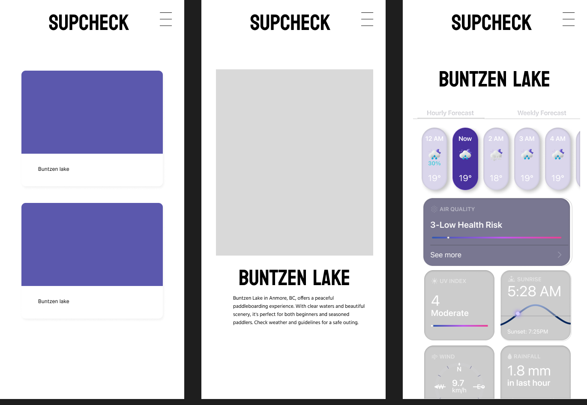

# SUPcheck

## Overview

SUPcheck is an application for stand-up paddleboarders to check the weather before going paddleboarding.

### Problem

Safety is important for paddleboarders; people need to check weather and water conditions. Some beginners may not know how to read the water condition. This application will warn users if it is not suitable for paddleboarding.

### Features

#### 1. Location Lookup
- **Discover Paddleboarding Locations:** Users can easily search and discover various paddleboarding spots.

#### 2. Location Information
- **Detailed Location Insights:** Obtain detailed information about the paddleboarding locations, including if day passes are required, rental services, and addresses for easy navigation.

#### 3. Weather Information
- **Real-time Weather Updates:** Obtain current weather conditions and forecasts for selected locations, specifying dates and times for planning paddleboarding activities.

### User Profile

- Paddleboarder:
    - Looking for spots to paddleboard in BC Lower Mainland.
    - Wants to check the weather before paddleboarding.
    - Wants information about where to rent a paddleboard.

## Implementation

### Front-end Tech Stack

- React
- Vite
- SASS
- Axios

### Back-end Tech Stack
- Express.js
- Node.js
- Knex.js
- MySQL

### External APIs

- Open-meteo API
- Google Map API

### Sitemap

- Home page (locations list)
- Single location 

## Data
### Location
- id: int
- name: varchar
- Longitude: decimal
- Latitude: decimal
- Rental: boolean
- Day Pass: boolean

### Weather
- temperature_2m: decimal
- visibility: decimal
- wind_speed_10m: decimal
- wind_gusts_10m: decimal
- precipitation: decimal
- wave_height: decimal
- sunset: DATETIME
- sunrise: DATETIME

## Endpoints

GET /locations/:id
- Get location by id
Parameters:
- id: location id as number

GET /location/:id/weather
- Get weather by id
Parameters:
- id: location id as number

## Setup
### Backend 
Navigate to SUPcheck-api Directory

```
cd SUPcheck-api
```
Use .env.sample as a template to create Environment File
- Create a new file named .env in the SUPcheck-api directory
- Copy the content of .env.sample into .env.
- Replace placeholders <YOUR_DB_NAME>, <YOUR_DB_USER>, and <YOUR_DB_PASSWORD> with your MySQL database details
- Define other environment variables (e.g., PORT=8080).

Install nodeJS dependencies
```
npm i
```
Create and select the SUPcheck database in MySQL workbrench
```
CREATE DATABASE SUPcheck;
USE SUPcheck;
```

Create database tables with knex migrations
```
npm run migrate
```

Seed the tables with data
```
npm run seed
```

Run Express App in development mode
```
npm run dev
```
### Frontend 
Navigate to SUPcheck Directory

```
cd SUPcheck
```
Install nodeJS dependencies
```
npm i
```
Run React App in development mode
```
npm run dev
```
## Screenshots



## Nice-to-haves
- Favourite function 
    - User can save their favourite location and it will show on the top of the list

