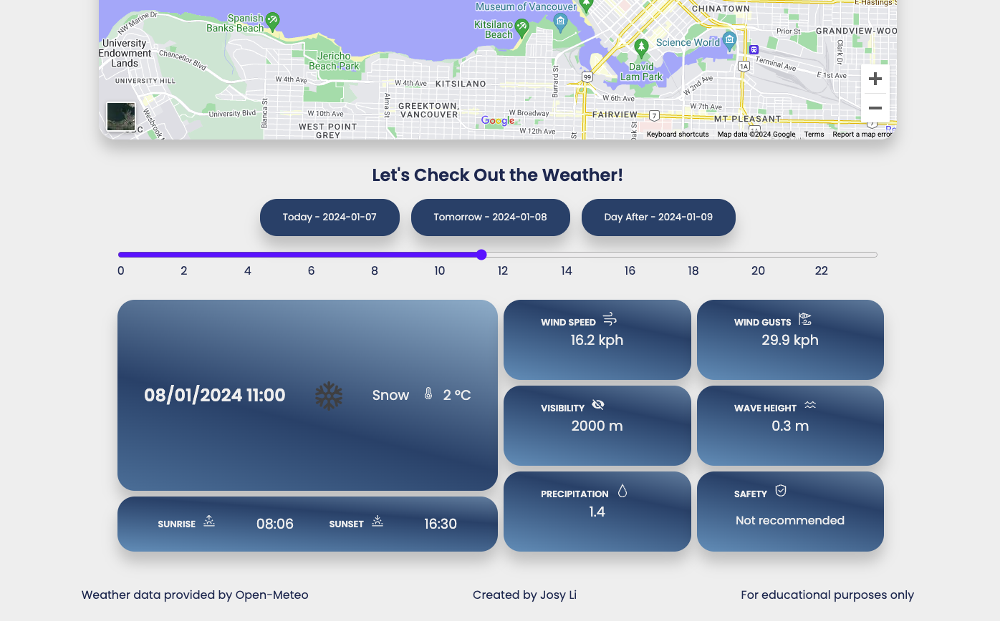

# SUPcheck

## Overview

SUPcheck is an application for stand-up paddleboarders to check the weather before going paddleboarding.

## Implementation

### Front-end Tech Stack

- React
- Vite
- SASS
- Axios

### Back-end Tech Stack
- Express.js
- Node.js
- Knex.js
- MySQL

### External APIs

- Open-meteo API
- Google Map API

### Sitemap

- Home page (locations list)
- Single location 

### Data
#### Location
- id: int
- name: varchar
- Longitude: decimal
- Latitude: decimal
- Rental: boolean
- Day Pass: boolean

#### Weather
- temperature_2m: decimal
- visibility: decimal
- wind_speed_10m: decimal
- wind_gusts_10m: decimal
- precipitation: decimal
- wave_height: decimal
- sunset: DATETIME
- sunrise: DATETIME

### Endpoints

GET /locations/:id
- Get location by id
Parameters:
- id: location id as number

GET /location/:id/weather
- Get weather by id
Parameters:
- id: location id as number

## Setup
### Backend 
Navigate to SUPcheck-api Directory

```
cd SUPcheck-api
```
Use .env.sample as a template to create Environment File
- Create a new file named .env in the SUPcheck-api directory.
- Copy the content of .env.sample into .env.
- Replace placeholders <YOUR_DB_NAME>, <YOUR_DB_USER>, and <YOUR_DB_PASSWORD> with your MySQL database details.

Install nodeJS dependencies
```
npm i
```
Create and select the SUPcheck database in MySQL workbrench
```
CREATE DATABASE SUPcheck;
USE SUPcheck;
```

Create database tables with knex migrations
```
npm run migrate
```

Seed the tables with data
```
npm run seed
```

Run Express App in development mode
```
npm run dev
```
### Frontend 
Navigate to SUPcheck Directory

```
cd SUPcheck
```
Install nodeJS dependencies
```
npm i
```
Run React App in development mode
```
npm run dev
```
## Screenshots
<!-- Location list

Single location

Weather-mobile

Weather-tablet

Weather-desktop
 -->

## Screenshots

| Location List | Single Location | Weather (Mobile) | Weather (Tablet) | Weather (Desktop) |
| --- | --- | --- | --- | --- |
|  |  |  |  |  |


## Nice-to-haves
- Favourite function 
    - User can save their favourite location and it will show on the top of the list

